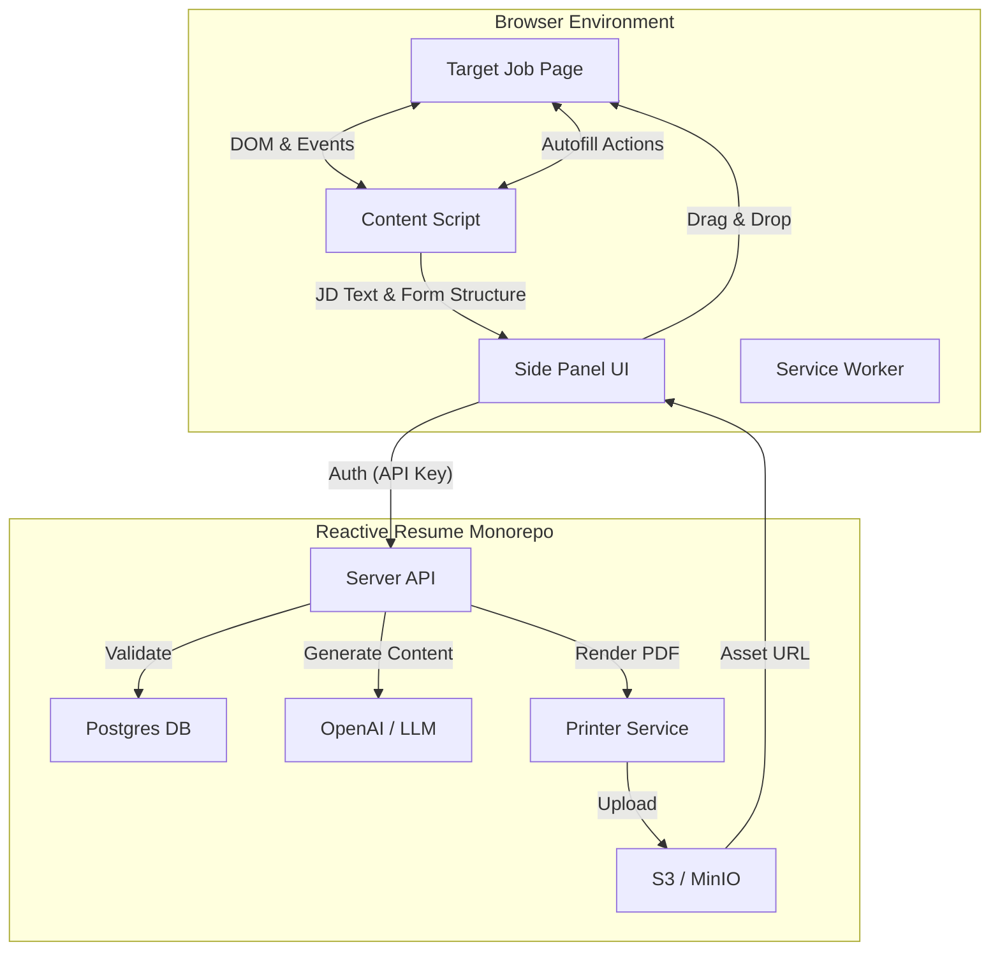

# 🧩 Project Blueprint: Reactive Resume Copilot (Browser Extension)

## 1. Executive Summary

The **Reactive Resume Copilot** is a Chrome Extension (Manifest V3) designed to streamline the job application process. It acts as a bridge between the user's "Information Bank" hosted on Reactive Resume and external job boards (LinkedIn, Indeed, Greenhouse, Workday, etc.).

**Core Value Proposition:**
1.  **Context-Aware Generation:** Scrapes job descriptions to generate tailored resumes and cover letters on the fly.
2.  **Universal Autofill:** Uses a local heuristic engine to map user data to arbitrary job application forms without server costs.
3.  **Seamless Integration:** Operates via a Side Panel UI, allowing users to manage assets without leaving the job post.

---

## 2. System Architecture

### 2.1. High-Level Diagram



### 2.2. Tech Stack & Monorepo Strategy

The extension will be treated as a first-class citizen within the existing Nx monorepo.

| Component | Technology | Rationale |
| :--- | :--- | :--- |
| **App Type** | `apps/extension` | New Nx React application using **CRXJS** + **Vite**. |
| **UI Framework** | React + Tailwind | Reuses `libs/ui` for visual consistency with the dashboard. |
| **State** | Zustand | Lightweight state management for the Side Panel. |
| **Communication** | `chrome.runtime` | Message passing between Content Script, Side Panel, and Background. |
| **Parsing** | `@mozilla/readability` | Robust extraction of Job Descriptions from cluttered HTML. |
| **Auth** | API Key | Stateless authentication suitable for "headless" clients. |

---

## 3. Functional Modules

### 3.1. Module A: Authentication (API Keys)
Since browser extensions often struggle with `SameSite` cookie policies and session persistence across different domains, we will implement a long-lived API Key mechanism.

*   **Database:** A new `ApiKey` table linked to `User`. Keys are hashed (bcrypt) before storage.
*   **UX:** Users generate keys in the Web Dashboard (`Settings -> Developer`).
*   **Security:** Keys have scopes (e.g., `extension:write`, `resume:read`) and can be revoked.

### 3.2. Module B: Context Extraction (The "Eyes")
The extension needs to understand what job the user is looking at.

*   **Trigger:** User clicks "Analyze Job" in the Side Panel.
*   **Logic:**
  1.  Content script injects `@mozilla/readability`.
  2.  Extracts `title` (Job Title), `siteName` (Company), and `textContent` (Description).
  3.  Sends sanitized data to the Side Panel.

### 3.3. Module C: Asset Generation (The "Brain")
Bridging the gap between the Job Description and the User's Information Bank.

*   **Endpoint:** `POST /api/extension/generate`.
*   **Input:** `jobDescription`, `jobTitle`, `companyName`, `template`.
*   **Process:**
  1.  **Resume:** Calls `OpenAIService.generateResume` using the User's Information Bank and the scraped JD.
  2.  **Persistence:** Creates a new `Resume` record in Postgres titled `"{Role} @ {Company}"`.
  3.  **Printing:** Calls `PrinterService` to generate the PDF immediately.
*   **Output:** Returns the PDF URL and Preview Image URL.

### 3.4. Module D: Heuristic Autofill (The "Hands")
A local, cost-effective engine to fill forms.

*   **Profile Flattening:** Converts the hierarchical `InformationDto` into a flat map of potential keywords.
  *   *Example:* `basics.email` $\to$ `["email", "e-mail", "mail", "username"]`.
*   **Scoring Algorithm:**
  1.  Iterate all `<input>`, `<select>`, `<textarea>` in the DOM.
  2.  Score each field against the flattened profile keys using fuzzy matching on `name`, `id`, `autocomplete`, `aria-label`, and nearest `<label>`.
  3.  Select the highest confidence match > threshold (e.g., 0.8).
*   **Event Simulation:**
  *   Modern frameworks (React/Angular) ignore direct value updates (`input.value = '...'`).
  *   We must dispatch trusted events: `input`, `change`, `blur`.

---

## 4. Implementation Plan

### Phase 1: Backend Infrastructure
**Goal:** Enable secure programmatic access to the backend.

*   [x] **Schema:** Update `tools/prisma/schema.prisma` to add `ApiKey` model.
*   [x] **Module:** Create `apps/server/src/api-key` module (Service, Controller, Module).
*   [x] **Guard:** Create `ApiKeyGuard` to validate `X-API-Key` header.
*   [x] **Settings UI:** Update `apps/client` settings page to allow creating/deleting API keys.

### Phase 2: Extension Skeleton & Shared Logic
**Goal:** Get the extension running in the monorepo and sharing UI components.

*   [x] **Scaffold:** Generate `apps/extension` using Nx/Vite/React.
*   [x] **Config:** Setup `manifest.json` (V3) with `side_panel` permissions.
*   [x] **Build:** Configure `vite.config.ts` with `@crxjs/vite-plugin`.
*   [x] **Styles:** Configure Tailwind to consume `libs/ui/tailwind.config.js`.
*   [x] **Auth UI:** Build the "Connect Account" screen in the Side Panel.

### Phase 3: The Generation Loop
**Goal:** Scrape a page and generate a resume file.

*   [x] **Extension API:** Create `apps/server/src/extension` module.
  *   Endpoint: `POST /generate/resume` (Composite endpoint handling Generation + Saving + Printing).
*   [x] **Content Script:** Implement `PageAnalyzer` using `@mozilla/readability`.
*   [x] **Side Panel:** Build the "Job Context" view (Edit Title, Company, Description).
*   [x] **UI:** Add "Generate" button and "Result" card (Download PDF, Drag-to-Upload).

### Phase 4: The Autofill Engine
**Goal:** Fill forms locally without server API costs.

*   [ ] **Library:** Create `libs/autofill` (Typescript library).
  *   Logic: `flattenProfile(user: UserDto)`, `scoreField(element, profile)`, `fillField(element, value)`.
*   [ ] **Integration:** Import `libs/autofill` into the Extension Content Script.
*   [ ] **UI:** Add "Autofill" button to Side Panel.
*   [ ] **Feedback:** Add simple toast notifications in the browser context ("Filled 14 fields").

---

## 5. Data Models

### Database: `ApiKey`
```prisma
model ApiKey {
  id        String   @id @default(cuid())
  name      String
  keyHash   String   // Bcrypt hash of the displayed key
  lastUsed  DateTime?
  createdAt DateTime @default(now())
  updatedAt DateTime @updatedAt

  user      User     @relation(fields: [userId], references: [id], onDelete: Cascade)
  userId    String

  @@index([userId])
}
```

### DTO: `ExtensionGenerateDto`
```typescript
export const extensionGenerateSchema = z.object({
  jobTitle: z.string(),
  companyName: z.string(),
  jobDescription: z.string(),
  template: z.string().default('rhyhorn'),
  // Optional: Allow user to pick specific profile/experience IDs to emphasize
});
```

---

## 6. Security & Privacy Considerations

1.  **API Key Storage:** Keys are stored in `chrome.storage.local`. This is sandboxed to the extension but accessible if the user's machine is compromised. This is standard practice.
2.  **Data Transmission:** Job Descriptions are sent to the server. We must ensure HTTPS is enforced.
3.  **No Tracking:** The extension **only** runs when the user explicitly opens the Side Panel or clicks a button. It does not passively monitor browsing history.
