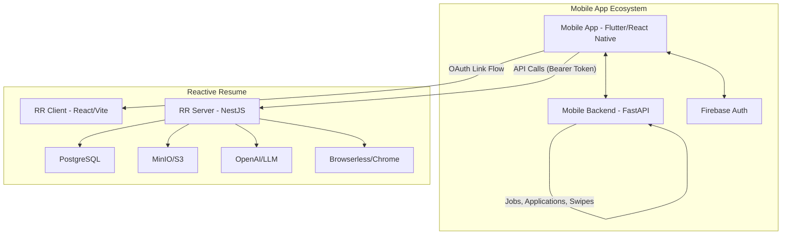
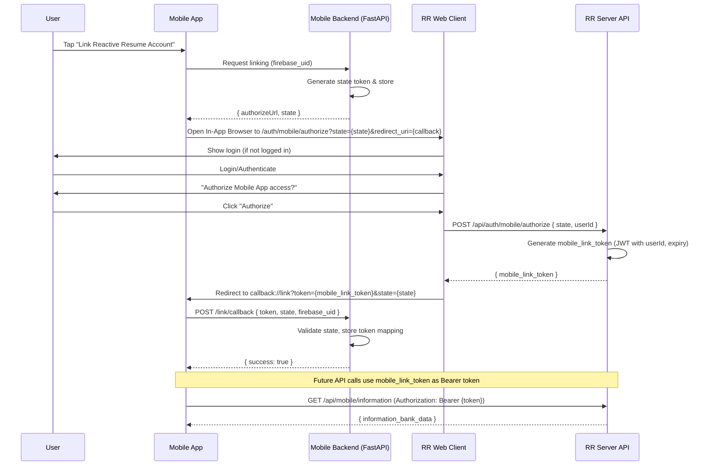
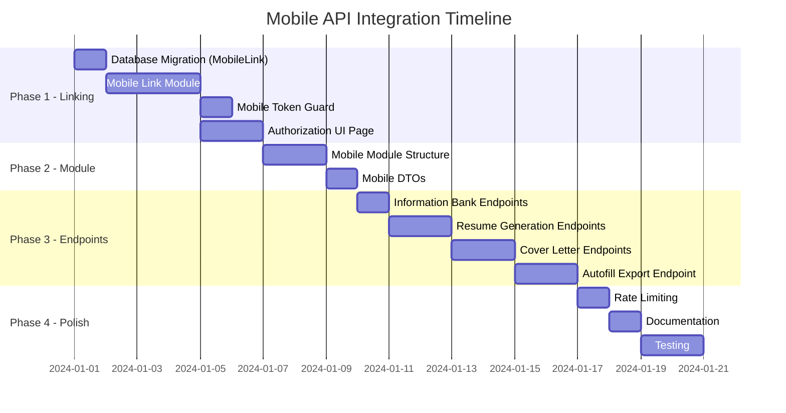

# 📱 Implementation Plan: Mobile App API Integration for AI-Powered Job Finder

## 1. Executive Summary

This plan outlines the integration strategy for connecting an AI-powered mobile job finder app (with its own FastAPI backend and Firebase authentication) with the Reactive Resume backend. 

### Scope Clarification

**Reactive Resume's Role (This Service):**
- Information Bank management (professional background data)
- AI-powered resume generation
- AI-powered cover letter generation
- Autofill data export for form filling
- OAuth-style account linking

**Mobile App Backend's Role (FastAPI Service - Out of Scope):**
- Job discovery, search, and recommendations
- Job applications tracking and management
- Swipe/matching functionality
- Firebase authentication
- User preferences and settings

The integration uses a **OAuth-style account linking flow** where users authorize their Reactive Resume account from within the mobile app via a dedicated authorization page—no manual API key copying required.

---

## 2. System Architecture

### 2.1 High-Level Integration Diagram



### 2.2 Relevant Existing Components

| Component | Location | Purpose |
|-----------|----------|---------|
| `ExtensionModule` | `apps/server/src/extension/` | API endpoints for browser extension (reference pattern) |
| `ApiKeyModule` | `apps/server/src/api-key/` | API key generation & validation (used internally for linking) |
| `AuthModule` | `apps/server/src/auth/` | OAuth flows (GitHub, Google, OpenID) - pattern for mobile linking |
| `InformationService` | `apps/server/src/information/` | User's professional information bank CRUD |
| `OpenAIService` | `apps/server/src/openai/` | AI-powered resume/cover letter generation |
| `ResumeService` | `apps/server/src/resume/` | Resume CRUD operations |
| `CoverLetterService` | `apps/server/src/cover-letter/` | Cover letter CRUD operations |
| `PrinterService` | `apps/server/src/printer/` | PDF generation via Browserless |

---

## 3. OAuth-Style Account Linking Flow

### 3.1 Flow Overview

Instead of manually copying API keys, users will experience a seamless OAuth-like authorization flow:



### 3.2 Token Strategy

| Token Type | Purpose | Expiry | Storage |
|------------|---------|--------|---------|
| `state` | CSRF protection during linking | 10 minutes | Mobile Backend (Redis/DB) |
| `mobile_link_token` | Long-lived access token for RR API | 30 days (auto-refresh) | Mobile Backend (encrypted) |
| `firebase_uid` | Mobile app user identifier | N/A | Mobile Backend |

**Auto-Refresh Behavior:**
- Tokens are automatically refreshed on each successful API request
- New token returned in `X-Refreshed-Token` response header when refreshed
- Mobile backend should update stored token when this header is present
- Tokens expire only after 30 days of inactivity

### 3.3 New Database Model for Linked Accounts

```prisma
model MobileLink {
  id            String    @id @default(cuid())
  userId        String    // RR User ID
  externalId    String    // Firebase UID or other external identifier
  deviceId      String?   // Optional device identifier for multi-device support
  deviceName    String?   // User-friendly device name (e.g., "John's iPhone")
  provider      String    @default("firebase") // 'firebase' | 'custom'
  tokenHash     String    // Hashed mobile_link_token
  lastUsed      DateTime?
  createdAt     DateTime  @default(now())
  updatedAt     DateTime  @updatedAt
  revokedAt     DateTime?

  user          User      @relation(fields: [userId], references: [id], onDelete: Cascade)

  @@unique([externalId, deviceId, provider]) // Allow same user, multiple devices
  @@index([externalId])
  @@index([userId])
}
```

> **Note:** The schema supports **multi-device linking** — a single Firebase user can link multiple devices (e.g., phone + tablet) to the same RR account. Each device gets its own token.

---

## 4. Implementation Tasks

### Phase 1: Account Linking Infrastructure

#### Task 1.1: Create Mobile Linking Module
**Priority:** High | **Effort:** Medium

Create the account linking infrastructure:

```
apps/server/src/mobile-link/
├── mobile-link.module.ts
├── mobile-link.controller.ts
├── mobile-link.service.ts
└── guards/
    └── mobile-token.guard.ts
```

**Endpoints:**
| Method | Endpoint | Description |
|--------|----------|-------------|
| `GET` | `/api/auth/mobile/authorize` | Initiate authorization (returns consent page) |
| `POST` | `/api/auth/mobile/authorize` | Complete authorization (generates token) |
| `POST` | `/api/auth/mobile/token/refresh` | Refresh mobile link token |
| `POST` | `/api/auth/mobile/revoke` | Revoke mobile link |
| `GET` | `/api/auth/mobile/status` | Check if current user has mobile links |
| `GET` | `/api/auth/mobile/devices` | List all linked devices for current user |
| `DELETE` | `/api/auth/mobile/devices/:id` | Unlink a specific device |
| `POST` | `/api/auth/mobile/webhook` | Register webhook URL for async notifications |
| `DELETE` | `/api/auth/mobile/webhook` | Remove webhook registration |

#### Task 1.2: Create Authorization UI Page
**Priority:** High | **Effort:** Medium

Create a new page in the client app:

```
apps/client/src/pages/auth/mobile-authorize.tsx
```

**Features:**
- Display mobile app name/icon
- Show requested permissions
- "Authorize" / "Deny" buttons
- Handle redirect back to mobile app with token

#### Task 1.3: Create Mobile Token Guard
**Priority:** High | **Effort:** Low

```typescript
// apps/server/src/mobile-link/guards/mobile-token.guard.ts
@Injectable()
export class MobileTokenGuard implements CanActivate {
  async canActivate(context: ExecutionContext): Promise<boolean> {
    const request = context.switchToHttp().getRequest<Request>();
    const authHeader = request.headers.authorization;
    
    if (!authHeader?.startsWith('Bearer ')) {
      throw new UnauthorizedException('Missing mobile token');
    }
    
    const token = authHeader.substring(7);
    const user = await this.mobileLinkService.validateToken(token);
    
    if (!user) {
      throw new UnauthorizedException('Invalid or expired mobile token');
    }
    
    request.user = user;
    return true;
  }
}
```

#### Task 1.4: Database Migration
**Priority:** High | **Effort:** Low

Add `MobileLink` model to Prisma schema:

```prisma
// tools/prisma/schema.prisma
model MobileLink {
  id            String    @id @default(cuid())
  userId        String
  externalId    String
  provider      String    @default("firebase")
  tokenHash     String
  lastUsed      DateTime?
  createdAt     DateTime  @default(now())
  updatedAt     DateTime  @updatedAt
  revokedAt     DateTime?

  user          User      @relation(fields: [userId], references: [id], onDelete: Cascade)

  @@unique([userId, provider])
  @@unique([externalId, provider])
  @@index([externalId])
}
```

---

### Phase 2: Mobile API Module

#### Task 2.1: Create Mobile Module Structure
**Priority:** High | **Effort:** Medium

```
apps/server/src/mobile/
├── mobile.module.ts
├── mobile.controller.ts
└── mobile.service.ts
```

**Register in:**
- `apps/server/src/app.module.ts`

#### Task 2.2: Create Mobile-Specific DTOs
**Priority:** High | **Effort:** Low

```
libs/dto/src/mobile/
├── index.ts
├── generate-resume.dto.ts
├── generate-cover-letter.dto.ts
└── autofill-export.dto.ts
```

```typescript
// libs/dto/src/mobile/generate-resume.dto.ts
export const mobileGenerateResumeSchema = z.object({
  jobTitle: z.string().min(1),
  companyName: z.string().optional(),
  jobDescription: z.string().min(1),
  template: z.string().default("rhyhorn"),
  outputFormat: z.enum(["pdf", "json", "both"]).default("pdf"),
});

// libs/dto/src/mobile/generate-cover-letter.dto.ts
export const mobileGenerateCoverLetterSchema = z.object({
  jobTitle: z.string().min(1),
  companyName: z.string().optional(),
  jobDescription: z.string().min(1),
  tone: z.enum(["professional", "friendly", "formal"]).default("professional"),
});

// libs/dto/src/mobile/autofill-export.dto.ts
export const autofillExportSchema = z.object({
  format: z.enum(["flat", "structured"]).default("structured"),
  includeFields: z.array(z.string()).optional(),
});
```

---

### Phase 3: Core API Endpoints

#### Task 3.1: User Profile & Information Bank Endpoints
**Priority:** High | **Effort:** Low

| Method | Endpoint | Description |
|--------|----------|-------------|
| `GET` | `/api/mobile/me` | Get authenticated user profile |
| `GET` | `/api/mobile/information` | Get full information bank |
| `PATCH` | `/api/mobile/information` | Update information bank |

#### Task 3.2: Resume Generation Endpoints
**Priority:** High | **Effort:** Medium

| Method | Endpoint | Description |
|--------|----------|-------------|
| `POST` | `/api/mobile/generate-resume` | Generate tailored resume from job description |
| `GET` | `/api/mobile/resumes` | List all user resumes |
| `GET` | `/api/mobile/resumes/:id` | Get specific resume |
| `GET` | `/api/mobile/resumes/:id/pdf` | Get resume PDF URL |

#### Task 3.3: Cover Letter Generation Endpoints
**Priority:** High | **Effort:** Medium

| Method | Endpoint | Description |
|--------|----------|-------------|
| `POST` | `/api/mobile/generate-cover-letter` | Generate tailored cover letter |
| `GET` | `/api/mobile/cover-letters` | List all cover letters |
| `GET` | `/api/mobile/cover-letters/:id` | Get specific cover letter |
| `GET` | `/api/mobile/cover-letters/:id/pdf` | Get cover letter PDF URL |

#### Task 3.4: Autofill Data Export Endpoint
**Priority:** High | **Effort:** Medium

| Method | Endpoint | Description |
|--------|----------|-------------|
| `POST` | `/api/mobile/autofill-export` | Export user data formatted for form filling engine |

**Response Format (structured):**
```json
{
  "basics": {
    "fullName": "John Doe",
    "firstName": "John",
    "lastName": "Doe",
    "email": "john@example.com",
    "phone": "+1234567890",
    "location": {
      "address": "123 Main St",
      "city": "San Francisco",
      "state": "CA",
      "postalCode": "94102",
      "country": "USA"
    },
    "url": "https://johndoe.com",
    "linkedIn": "https://linkedin.com/in/johndoe"
  },
  "education": [...],
  "experience": [...],
  "skills": [...],
  "certifications": [...],
  "languages": [...]
}
```

---

### Phase 4: Client-Side Authorization Page

#### Task 4.1: Create Authorization Route
**Priority:** High | **Effort:** Medium

```
apps/client/src/pages/auth/mobile-authorize/
├── index.tsx
└── _components/
    ├── AuthorizationCard.tsx
    └── PermissionsList.tsx
```

#### Task 4.2: Add Route Configuration
**Priority:** High | **Effort:** Low

Update router configuration to include the new authorization page.

---

## 5. API Reference

### Authentication

All mobile endpoints use Bearer token authentication:

```http
Authorization: Bearer {mobile_link_token}
```

### Account Linking Endpoints

```yaml
# Authorization Flow
GET  /api/auth/mobile/authorize?state={state}&redirect_uri={uri}  # Show consent page
POST /api/auth/mobile/authorize                                    # Complete & get token
POST /api/auth/mobile/token/refresh                               # Refresh token
POST /api/auth/mobile/revoke                                      # Revoke link
GET  /api/auth/mobile/status                                      # Check link status
```

### Mobile API Endpoints

```yaml
# User & Information
GET    /api/mobile/me                    # Get user profile
GET    /api/mobile/information           # Get information bank
PATCH  /api/mobile/information           # Update information bank

# Resumes
GET    /api/mobile/resumes               # List resumes
GET    /api/mobile/resumes/:id           # Get resume by ID
POST   /api/mobile/generate-resume       # Generate new tailored resume
GET    /api/mobile/resumes/:id/pdf       # Get PDF download URL

# Cover Letters
GET    /api/mobile/cover-letters         # List cover letters
GET    /api/mobile/cover-letters/:id     # Get cover letter by ID
POST   /api/mobile/generate-cover-letter # Generate new cover letter
GET    /api/mobile/cover-letters/:id/pdf # Get PDF download URL

# Autofill
POST   /api/mobile/autofill-export       # Export data for form filling
```

---

## 6. Security Considerations

### 6.1 OAuth-Style Security

- **State Parameter:** CSRF protection during authorization flow
- **Redirect URI Validation:** Only allow registered callback URIs
- **Token Hashing:** Mobile link tokens hashed with bcrypt before storage
- **Auto-Refresh:** Tokens automatically refresh on use, expire after 30 days of inactivity
- **Revocation:** Users can revoke mobile access from RR dashboard
- **Multi-Device:** Each device gets its own token; revoking one doesn't affect others

### 6.2 Webhook Security

- **Signature Verification:** All webhook payloads signed with HMAC-SHA256
- **Secret per Link:** Each mobile link has its own webhook secret
- **Retry Logic:** Failed deliveries retried up to 3 times with exponential backoff
- **Payload Encryption:** Sensitive data in payloads encrypted with link-specific key

### 6.3 Rate Limiting

```typescript
@Throttle({ default: { limit: 10, ttl: 60000 } }) // 10 requests per minute
@Controller("mobile")
@UseGuards(MobileTokenGuard)
export class MobileController { }
```

### 6.4 AI Generation Limits

- Maximum 10 resume generations per hour
- Maximum 20 cover letter generations per hour
- Queue system for high-load scenarios

### 6.5 Data Privacy

- RR only stores information bank data (what user explicitly provides)
- No Firebase user data synced to RR
- Mobile app controls job/application data independently
- User can unlink account at any time (revokes token)

---

## 7. Implementation Order



---

## 8. Files to Create/Modify

### New Files

```
# Account Linking
apps/server/src/mobile-link/
├── mobile-link.module.ts
├── mobile-link.controller.ts
├── mobile-link.service.ts
└── guards/
    └── mobile-token.guard.ts

# Mobile API
apps/server/src/mobile/
├── mobile.module.ts
├── mobile.controller.ts
└── mobile.service.ts

# DTOs
libs/dto/src/mobile/
├── index.ts
├── generate-resume.dto.ts
├── generate-cover-letter.dto.ts
├── autofill-export.dto.ts
└── mobile-link.dto.ts

# Client Authorization Page
apps/client/src/pages/auth/mobile-authorize/
├── index.tsx
└── _components/
    ├── AuthorizationCard.tsx
    └── PermissionsList.tsx
```

### Modified Files

```
tools/prisma/schema.prisma             # Add MobileLink model
apps/server/src/app.module.ts          # Register MobileLinkModule, MobileModule
libs/dto/src/index.ts                  # Export mobile DTOs
apps/client/src/router/index.tsx       # Add mobile-authorize route
```

---

## 9. Mobile Backend Integration Guide

### 9.1 Initiating Account Link (FastAPI Side)

```python
# Example: Mobile Backend (FastAPI)
import secrets
from datetime import datetime, timedelta

@router.post("/link/initiate")
async def initiate_link(firebase_uid: str, db: Session = Depends(get_db)):
    state = secrets.token_urlsafe(32)
    
    # Store state with expiry
    await redis.setex(f"link_state:{state}", 600, firebase_uid)  # 10 min expiry
    
    redirect_uri = "yourapp://link/callback"
    authorize_url = f"{RR_BASE_URL}/auth/mobile/authorize?state={state}&redirect_uri={redirect_uri}"
    
    return {"authorizeUrl": authorize_url, "state": state}

@router.post("/link/callback")
async def link_callback(token: str, state: str, db: Session = Depends(get_db)):
    # Validate state
    firebase_uid = await redis.get(f"link_state:{state}")
    if not firebase_uid:
        raise HTTPException(400, "Invalid or expired state")
    
    # Store mapping
    await db.execute(
        "INSERT INTO mobile_links (firebase_uid, rr_token) VALUES (?, ?)",
        [firebase_uid, encrypt(token)]
    )
    
    await redis.delete(f"link_state:{state}")
    return {"success": True}
```

### 9.2 Making API Calls to Reactive Resume

```python
# Example: Calling RR API from Mobile Backend
async def generate_resume(firebase_uid: str, job_data: dict):
    # Get stored token
    link = await db.query("SELECT rr_token FROM mobile_links WHERE firebase_uid = ?", firebase_uid)
    token = decrypt(link.rr_token)
    
    async with httpx.AsyncClient() as client:
        response = await client.post(
            f"{RR_BASE_URL}/api/mobile/generate-resume",
            headers={"Authorization": f"Bearer {token}"},
            json={
                "jobTitle": job_data["title"],
                "companyName": job_data["company"],
                "jobDescription": job_data["description"],
                "template": "rhyhorn"
            }
        )
    
    return response.json()
```

---

## 10. Design Decisions

The following decisions were made based on requirements analysis:

| Question | Decision | Rationale |
|----------|----------|-----------|
| **App Registration System** | Not required | Since only one mobile app will consume this API initially, a full OAuth client registration system is overkill. The redirect URI will be validated against a configurable allowlist in environment variables. |
| **Token Scopes** | Not implemented | One user per account means all endpoints are accessible with a valid token. No granular permissions needed. |
| **Webhook Support** | Implemented (optional) | Mobile backend can register a webhook URL to receive async notifications for long-running operations (e.g., resume generation complete). |
| **Token Refresh Strategy** | Auto-refresh on use | Tokens automatically refresh on each successful API request. New token returned in `X-Refreshed-Token` header. Tokens expire after 30 days of inactivity. |
| **Multi-Device Support** | Supported | A single Firebase user can link multiple devices. Each device has its own token and can be individually revoked. |

---

## 11. Webhook System (Optional)

### 11.1 Webhook Registration

Mobile backend can register a webhook URL to receive notifications:

```http
POST /api/auth/mobile/webhook
Authorization: Bearer {mobile_link_token}
Content-Type: application/json

{
  "url": "https://your-mobile-backend.com/webhooks/reactive-resume",
  "events": ["resume.generated", "cover_letter.generated", "link.revoked"]
}
```

**Response:**
```json
{
  "id": "wh_clxxxxxxxxxx",
  "secret": "whsec_xxxxxxxxxxxxxxxxxxxxxxxx",
  "url": "https://your-mobile-backend.com/webhooks/reactive-resume",
  "events": ["resume.generated", "cover_letter.generated", "link.revoked"],
  "createdAt": "2024-01-01T00:00:00.000Z"
}
```

### 11.2 Webhook Events

| Event | Trigger | Payload |
|-------|---------|---------|
| `resume.generated` | Resume generation completes | `{ resumeId, title, pdfUrl, previewUrl }` |
| `cover_letter.generated` | Cover letter generation completes | `{ coverLetterId, title, pdfUrl }` |
| `link.revoked` | User revokes mobile link from dashboard | `{ deviceId, revokedAt }` |
| `token.refreshed` | Token was auto-refreshed | `{ newToken, expiresAt }` |

### 11.3 Webhook Payload Format

```http
POST https://your-mobile-backend.com/webhooks/reactive-resume
Content-Type: application/json
X-Webhook-Signature: sha256=xxxxxxxxxxxxxxxxxxxxxxxxxxxxxx
X-Webhook-Event: resume.generated
X-Webhook-Delivery-Id: del_clxxxxxxxxxx

{
  "event": "resume.generated",
  "timestamp": "2024-01-01T12:00:00.000Z",
  "data": {
    "resumeId": "clxxxxxxxxxx",
    "title": "Software Engineer @ Google",
    "pdfUrl": "https://storage.rxresu.me/...",
    "previewUrl": "https://storage.rxresu.me/..."
  }
}
```

### 11.4 Signature Verification (Mobile Backend)

```python
import hmac
import hashlib

def verify_webhook_signature(payload: bytes, signature: str, secret: str) -> bool:
    expected = hmac.new(
        secret.encode(),
        payload,
        hashlib.sha256
    ).hexdigest()
    return hmac.compare_digest(f"sha256={expected}", signature)

```

## 12. Implementation Checklists

### Phase 1: Account Linking Infrastructure

- [x] Create `MobileLink` Prisma model
- [x] Run database migration
- [x] Create `mobile-link.module.ts`
- [x] Create `mobile-link.controller.ts`
- [x] Create `mobile-link.service.ts`
- [x] Implement `MobileTokenGuard`
- [x] Implement token generation (JWT with 30-day expiry)
- [x] Implement token validation with auto-refresh
- [x] Implement token hashing (bcrypt)
- [x] Add `X-Refreshed-Token` header logic
- [x] Create authorization consent page (`/auth/mobile/authorize`)
- [x] Implement redirect URI validation (allowlist)
- [x] Add device management endpoints (`GET /devices`, `DELETE /devices/:id`)
- [x] Register `MobileLinkModule` in `app.module.ts`

### Phase 2: Mobile API Module

- [x] Create `mobile.module.ts`
- [x] Create `mobile.controller.ts`
- [x] Create `mobile.service.ts`
- [x] Create DTOs in `libs/dto/src/mobile/`
  - [x] `generate-resume.dto.ts`
  - [x] `generate-cover-letter.dto.ts`
  - [x] `autofill-export.dto.ts`
  - [x] `mobile-link.dto.ts`
- [x] Export DTOs from `libs/dto/src/index.ts`
- [x] Register `MobileModule` in `app.module.ts`

### Phase 3: Core API Endpoints

- [x] `GET /api/mobile/me` - User profile
- [x] `GET /api/mobile/information` - Get information bank
- [x] `PATCH /api/mobile/information` - Update information bank
- [x] `GET /api/mobile/resumes` - List resumes
- [x] `GET /api/mobile/resumes/:id` - Get resume by ID
- [x] `POST /api/mobile/generate-resume` - Generate tailored resume
- [x] `GET /api/mobile/resumes/:id/pdf` - Get resume PDF URL
- [x] `GET /api/mobile/cover-letters` - List cover letters
- [x] `GET /api/mobile/cover-letters/:id` - Get cover letter by ID
- [x] `POST /api/mobile/generate-cover-letter` - Generate cover letter
- [x] `GET /api/mobile/cover-letters/:id/pdf` - Get cover letter PDF URL
- [x] `POST /api/mobile/autofill-export` - Export autofill data

### Phase 4: Webhook System (Optional)

- [x] Create `MobileWebhook` Prisma model
- [x] `POST /api/auth/mobile/webhook` - Register webhook
- [x] `DELETE /api/auth/mobile/webhook` - Remove webhook
- [x] Implement webhook signature generation (HMAC-SHA256)
- [x] Implement webhook delivery with retry logic
- [x] Add `resume.generated` event trigger
- [x] Add `cover_letter.generated` event trigger
- [x] Add `link.revoked` event trigger

### Phase 5: Client-Side Updates

- [x] Create `/auth/mobile-authorize` route
- [x] Create `AuthorizationCard` component
- [x] Create `PermissionsList` component
- [x] Add "Linked Devices" section to Settings page
- [x] Implement device revocation UI

### Phase 6: Security & Polish

- [x] Implement rate limiting (`@nestjs/throttler`)
- [x] Add AI generation limits (10 resumes/hour, 20 cover letters/hour)
- [x] Add request logging for mobile endpoints
- [x] Write API documentation (Swagger/OpenAPI)
- [x] Write integration tests
- [x] Security audit (basic - token hashing, rate limiting, input validation)

### Success Criteria

- [x] OAuth-style linking flow works end-to-end
- [x] Users can authorize mobile app in < 30 seconds
- [x] Mobile app can read/update Information Bank via API
- [x] Mobile app can generate tailored resumes via API
- [x] Mobile app can generate cover letters via API
- [x] Mobile app can export autofill data via API
- [x] Users can link multiple devices
- [x] Users can revoke individual devices from RR dashboard
- [x] Tokens auto-refresh on use
- [x] Webhook notifications delivered successfully (if configured)
- [ ] API response times < 500ms (excluding AI generation)
- [ ] AI generation completes < 30 seconds
- [ ] Zero authentication-related security vulnerabilities
---

